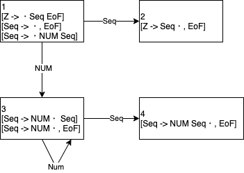

# 7.1

```
0: Z    -> List EoF
1: List -> LPAR Seq RPAR
2: List -> NUM
3: Seq  -> List
4: Seq  -> Seq COMMA List
```

|  | NUM|COMMA|LPAR|RPAR| EoF|List| Seq|
|--|----|----:|----|----|---:|----|----|
| 1|S(4)|     |S(5)|    |    |S(2)|    |
| 2|    |     |    |    |  A |    |    |
| 3|R[3]|R[3] |R[3]|R[3]|R[3]|    |    |
| 4|R[2]|R[2] |R[2]|R[2]|R[2]|    |    |
| 5|S(4)|     |S(5)|    |    |S(3)|S(7)|
| 6|S(4)|     |S(5)|    |    |S(8)|    |
| 7|    |S(6) |    |S(9)|    |    |    |
| 8|R[4]|R[4] |R[4]|R[4]|R[4]|    |    |
| 9|R[1]|R[1] |R[1]|R[1]|R[1]|    |    |

入力
```
LPAR LPAR NUM RPAR COMMA NUM RPAR EoF
```

構文解析

|  | Stack | Rest Input |
|--|:--|:--|
| 1|1 | LPAR LPAR NUM RPAR COMMA NUM RPAR EoF |
| 2|1 LPAR 5 | LPAR NUM RPAR COMMA NUM RPAR EoF |
| 3|1 LPAR 5 LPAR 5 | NUM RPAR COMMA NUM RPAR EoF |
| 4|1 LPAR 5 LPAR 5 NUM 4 | RPAR COMMA NUM RPAR EoF |
| 5|1 LPAR 5 LPAR 5 | List COMMA NUM RPAR EoF |
| 6|1 LPAR 5 LPAR 5 List 3 | COMMA NUM RPAR EoF |
| 7|1 LPAR 5 LPAR 5 | Seq NUM RPAR EoF |
| 8|1 LPAR 5 LPAR 5 Seq 7 | NUM RPAR EoF |
| 9|エラー | RPAR EoF |

# 7.2

# 7.3

```
0: Z -> Seq EoF
1: Seq -> ε
2: Seq -> NUM Seq
```



構文解析表

|  | NUM| Seq| EoF|
|--|----|----|---:|
| 1|S(3)|S(2)|R[1]|
| 2|    |    | A  |
| 3|S(3)|R[2]|R[1]|
| 4|    |    |R[2]|

構文解析結果

| | Stack | Rest Input |
|-|--|--|
|1|1 |NUM NUM EoF|
|2|1 NUM 3| NUM EoF|
|3|1 NUM 3 NUM 3| EoF|
|4|1 NUM 3 |Seq EoF|
|5|1 | Seq EoF|
|6|1 Seq 2| EoF|

# 7.4

```
0: Z -> Input EoF
1: Input -> Seq
2: Seq -> ε
3: Seq -> LPAR Seq RPAR
```

![7.4.png](https://www.draw.io/?lightbox=1&highlight=0000ff&edit=_blank&layers=1&nav=1&title=7.4#R7VtNc6M4EP01rpo9JAUCbHyMY2eSKu9WKt7K7sxNMTIwg5EX5MTOr1%2FJiA8hcIiNg5yZS4IaScDr7qfWA%2FeM6%2BXmawRX3p%2FYQUEPaM6mZ4x7AAyGA%2FqXGbaJwbRBYnAj30lMem6Y%2Ba%2BIGzVuXfsOioWOBOOA%2BCvROMdhiOZEsMEowi9itwUOxKuuoIskw2wOA9n6j%2B8QL7HaYJDbb5HveumV9f4wObOEaWf%2BJLEHHfxSMBmTnnEdYUySo%2BXmGgUMuxSXZNxNzdnsxiIUkiYD4A%2F3ZzT7NvYeL7Z3xg26nVm3F9wZMdmmD4wc%2Bvy8iSPiYReHMJjk1lGE16GD2KwabeV9phivqFGnxh%2BIkC13JlwTTE0eWQb8LNr45F82%2FNLirW%2BFM%2BMNn3nX2PKG%2FLQcgBivozna84i8H3uuwkCO0VeEl4hEW9ohQgEk%2FrPod8jDx836ZUPvsU9vBWg80nVgJUO2aVsTpyAwchHho3I%2F0YPCbeSmnffe4UkzudozDNb8EWbovy68e7SnEqD29DPa9qjgi%2FcC35eAvwtXa%2FI5obeUgn4oQd8tndmmXiS0S0039pIaa9yjyKdooKgtonvTh7ZSPkwX%2BoITp%2FdXD5WOnMInWl0I4MPAd0N6PKdwMQxHzygiPl2%2Fr%2FiJpe84iZ9R7L%2FCp918DOgVY%2BLd01ijnjWuhH5v1NELoY0ADi9C%2BEWEdV5Alo%2FSLjXLsIVVI%2BW2QxejdBpTHIEXixidZNnRJe9RSz%2Bg%2BI2eInrksiOK8Hfa6YK24ZIm1SixUngmRs82eqMRp0xtgm%2BYL6pmSLvsmYWteDWjd4vhvrEHD0yiVUv6PbCGNZaiVySZF88naLaCu3R%2BoXVzdUwHaEH2MYIUgbWRZmpClKXNl7yi1Qfc5hWqWVurD7zjkh4owdyHc63dkGv11qvP43A3GleJanBtFihtkO2gVKEfR7Wn51Zbcpb5LorizCTQY4GifrNkKUTAUKRJoHXOk5YUAg91xZGyXKk3LUx1Uy2ylGubg%2FKPnc7yJ%2B0TPsXs35lkgtFvmAnWyTJB1jcOdgYnIIHT1MLfMlXDXyYiUAk%2F7VNd6qflewY7K%2FVpUz3wy8HfFHvzVNjLRZvxzh2SQEHqIW4euO6eDHHd7mKJ%2FVhdHLQuozYTxq3BxwrjuqwSnp0ynvrqbWkcKFVCAVncO0NxvDn6mlroywVst7TWrT7e2I2gr5YbZbFMcYW8tgL4JSVyINdvZ6qR77nypxCAyjL5sGv9B8i73jNbOvtNOVett5JA3u%2BqLZRnkfIrCuVA%2Fgaje6UcXHOuZnjfHDvdOdCnJJxYnfPnQAqM89PPQdOXjWCoFoe29P7qE%2BjnA7trRQvIKkhr%2BnnOdDeq%2BqMvrmh2hT%2ByD3U%2FRtOVlRFwpKAurDgK%2BqCUE1b6cvOtnDBO5gN5Y32UsJ7hrx745oEr8%2BniX94Uy6ty6FyxT%2FhZJR3AOPbn1cJSUVTSLgepeF6jKYX09rNRrJEMA1bazsftWtnA4Gl3Kx6O%2FFccEhh80M6oqRpV8KVV4crUdqScb5SLvHLxljy5JOdLE5nlmCznec17ARoScFvoxrdMtTdslm94KPxOgh4kM7a6IzHkjbviml2WkEdvIC9oMhm21Uq0lQa0soVc%2F%2F04mQYx%2BOtWuzXvvnuP7txNv2PtRhn%2FGAKrpJHTfv5oVwdK6%2FuPSpfKq3u3Kdg4s0Sf1IfrXtX8uPQ7fcLJ6%2F%2F04Yv2h%2BQeChkRPROTCP9E1zjA7J1QiEPmhIUfBCVTcw9WlWNictd6UMqeWqfo4jKkyxWYWbFql39F1lp2VPxebConh4x%2Bm3nBGDFOyFFvB2Qggmz25T1GSyjTZv7bzSQp8h%2FAGpP%2FAQ%3D%3D)

## (1)
状態3 で衝突があるため、 LR(0) 文法ではない

## (2)
衝突がないので SLR(0) 文法

# 7.5

```
0: Z -> Input EoF
1: Input -> Seq
2: Seq -> ε
3: Seq -> EX Seq EX
4: Seq -> QU Seq QU
```

## (1)

![7.5 SLR](https://www.draw.io/?lightbox=1&highlight=0000ff&edit=_blank&layers=1&nav=1&title=7.5#R7V1de6I4FP41XrYPJHxejq1td9uZndk%2B%2B2xn76imyj4ILmLV%2FvoNkgghAZEPiR1vZiBCAufjzZuTc%2BgA3sw396GzmH0NJsgbAGWyGcDbAQCmbeJ%2F44Zt0qBZIGmYhu4kaVLThmf3A5FGhbSu3AlaMhdGQeBF7oJtHAe%2Bj8YR0%2BaEYbBmL3sLPHbUhTNFXMPz2PH41r%2FdSTRLWi1gpu0PyJ3O6MiqYSe%2FzB16MXmT5cyZBOtMExwN4E0YBFFyNN%2FcIC%2BWHZVLct9dwa%2F7BwuRH1W54WEB0Ndvjx9%2FPH97eATzH%2BEXbXgFk17eHW9FXpg8bLSlEkATLBByGoTRLJgGvuON0tZhGKz8CYqHUfBZes1TECxwo4ob%2F0VRtCXadVZRgJtm0dwjv6KNG71kjn%2FGXV0DnZzebkjXu5MtOeHfn4hkGazCMSp5aWpHTjhFUcl1RBaxADIDEOneo2COonCLLwiR50TuO2sxDjG86f66VDf4gKjnCFVpnKp%2B8xerSKivJ%2BcVuyEjY8dzpz4%2BHmNxoRA3vKMwcrGhfyE%2FzN3JJFEnWrofzuuuv1jQi8D1o93b6MOBfisUfalx4YHQRuStZBDGIepJltz6PX7UzCXB29sSRZzo9yPU14bBaeMZ%2FdeH7xS6wUHz1ts275wSiMoBJAORGUClgEi7SPyV3NW%2BpjSlD7VQSFOuTT2DamoppGEVhtuXDPjF5z%2BzP6b37c5Oh4WWXFiocu734y%2BJkZDaYAMoJHcp14piaoxDkWlKXqzklYVbDA8LbPga4qNpfIRF%2Bg%2B%2B6AqfO3PsY8OkFYtjBAcWHAyHZLpTRsFdLHy%2BB9Iycd8zndK7SjqOkTvtEL9itgdhpzusL%2BtycDMaDPW4Bdxwj9zOCOS25cLx6X2jF3xFcic%2BZAbMXtbqc8R%2BR8bEh8UvmfNNFmDXMzdCzwtnB1VrvJAQe6yH3tLOBGjHuVehG5kK40LUP9cpxVcN0jbL0ntFKfarRoimcz4Ciy2cUWZTa%2BS758xFLt1BwCpvr5RD2tO6Uh7glAeOADiKUFnXTq7wX5fxf1Rfcquhqg%2FpXWlB5dUgFSE%2FyMXMilxMVaUiYyofRChaC8nBxvaG0piNXSnXquzsy%2BS0ozWfWcqJRZ6TsHBWdHMZs9mTGjz2MVNXvckR3MUj3TF85hDP%2FKREyWJBXgKmpPJU6bxgnsL3YZzX5MJ5PuYVu4m8ME8NpRWYN9koFpQd9qmVZbSly4n7RXDffNYoXwRLDbTQ7p1O8xsOxmc0oKKhS62NZQkFI7EyORdDNFig00SGaJ%2FSEOn8LvFey8E536o45QO5lnYWJ3mzMQTseDATe%2BUJschBOwmDZXy49YUFG40l%2Fcvl6%2FkYjgT0HvDTznm5euX9V8ohJfF1wK%2BrpN5T2xtKK%2FTeOC92D3h2b7WDzMmP2ajF2TCXPJr1z6GBKL%2BK14kt3C2ooCZ8KGak56MzRTa6aXMqE0U5%2FMmXOLswhjzPWS7d8aAg%2FQOq9iCb1WbT04IUEHzyHYUufpcYR2VPCzErTmEZbeolymyYarR3%2BDydOZBqxHWkaWxHewukHSWC6SxnSeWD9k2MkDFAszytMjU2xtIylte6sVXd95Lb2GDeRuoaG8xbbYGxYd0728xlhEkVPrCecw6byRfGB0mH7Royv4IUkcqKhnxUfrDEhlw1me4XMeTWjK3dqbsWaqqssZndGVvVkNIFNbtZgdGUzg6QraaxHUQ25L3uHmUWhO5H4EeOdxILvMBds3k7H6Q7xcQNefPmjbvHMFznVQs6ZIRuVKxa4M1NVco76hinIB8pkr5uqHm2%2FJa5S944HpSjAK9HN1NZ77DqulkOJLmOunYzfttC7iRI2Lw6Ly1JgRYjfPndjk9lksrtDm8yVeVesPUqv0bBVVgtsCWPl1BD%2BSVzyKDdh1ecS%2BlkdR%2FsrXjy8cN1fr83jaeVtn6Y%2Fxk%2B%2BI9zQTme1Pu81Ahbmahs05Dd6QAfMm1cLpnmu5RnudQqnRR33lUZZYej5RJ2OircZLdvK4yS80y58lQNUfGdKYjeqKpS7GTN8KzXWYqN3HX1yZL2aVzBMkph1WvR7fn2l1FCXQryWmSZnEptrxV%2BqGgSzU1i9QBOPT2l4tYKnJ%2Bh%2F1E2cKowhqi4ik9YElUQFk99SfYrm%2FFbOMGeJvWXry2o8RB1uUCFaoF8VctJ6iVSpdT%2BeMRhhlRTgSLWVOEphYnc58OuTKMiu8rvYbVHrkT7QLwKRZVBR5cANNBqQzzI5%2F9fIKBKRUb%2FEFCvbuSsIEBVqq6w2sAAMSngWZ%2Fo4zRlAYNcVrmcXzTR8ntIVdG3uw%2FL8BlNQCj5il%2BWkVTutNT02JhCZ3KHfAzuM9Lgk097pbG20q9iXOaWNjxNN2Xjl%2FzUIlKh6MsFNR2tD3p5WW6Wcs3LclMSrmlZfcOB4KMTgBMafrlILJk2Ir9xrHGZhB1LczTq1yUaKi9mIJByPlOwPSkLvzb52aRs9i3lKklGXVS%2BFAqzvTD3aVK1QS7D2q6dhJsLq5sWZDvqeFtLUAYlS9pTuem2sa2FpW0y0r9qmPhEl41sp4C9v7tNMEFxpn7%2B6JmrwzZN2C96CuprjM8nZVvvSsr4NP3bMonpp3%2BgB47%2BBw%3D%3D)

状態 4, 7 に還元衝突があるので SLR(0) 文法ではない

## (2)

![7.5 LR1](https://www.draw.io/?lightbox=1&highlight=0000ff&edit=_blank&layers=1&nav=1&title=7.5%20LR1#R7Vxbd6M2EP41PCYHBBj8GCfepE12223Onmb7phjFpgcjinFs59dXgGQQkjGxudnrlxwY6%2FqNvpnRSETRb%2Bfr%2BxAGs6%2FYQZ4CVGet6HcKANbQIn9jwSYVGDZIBdPQdVKRlgme3Q9EhSqVLl0HLbiCEcZe5Aa8cIJ9H00iTgbDEK%2F4Ym%2FY43sN4BQJgucJ9ETp364TzVKpDaxM%2FoDc6Yz1rA2G6S9zyArTmSxm0MGrnEgfK%2FptiHGUPs3Xt8iLsWO4pPW%2B7Ph1O7AQ%2BVGVCg8BQF%2B%2FPX788fzt4RHMv4c3xuhKp4N7h96SzpiONtowCJBDEKGvOIxmeIp96I0z6SjES99BcT8qecvKPGEcEKFGhP%2BiKNpQ9cJlhIloFs09%2Bqs4Fzq9uO%2BcgM7sHuE5isINKRAiD0buO68tSJU%2B3ZbbVv0Tu6QLoNL1CUyqSLo8ByrfwgIvwwmilfLgFtrRNaO0nQiGUxQJ7ZCH3GwyUaK6z6hRE9T4mx8sI6kun%2BAr4SiHP%2FTcqU%2BeJwR%2FFBLBOwojl7Dghv4wdx0nVTVauB%2FwNWkvVnYQTymZpDlSzDupLstXHukJrWVcpr1wdOF0v%2BFqHboSWBH89rZAzWhH%2F9VJZnLk0MChLANGeUNN08wQFPmM%2FuszydjKO5xktJZ6reo2D37vaTfoN%2B3SVV8yAUABT1d12UzNuonM6eLTwFsC8OOXPrOELZSjWXKlXmsWb%2Bz03tNk2AUr0NqNXuLq1wSv9PVn7qe7NW06edmwF59MNa0FTPb%2BM%2F9jVi95YxXb4KDdFQcfP1z4%2B701eFoaq4f5X%2BGD%2Fzi%2FEgPC7z%2B6o2BlZlVh63Cfoxpag76Tji2rnH7I8AYemfjoNSRP0%2FiJoPgPKXRF3uGc8GqUSglUY12xdWU0olG%2BOsZfFHDLHtQYe7E1KnHc91wHrIWSTpIYR9o4mXu%2BNWkHSe2y5pXbsTIyY0nWSXO9xZ5ITUvFj6yjmnuJyUZ7iR%2F391JgJm9fVzM3Qs8BTCzVKoSBnK8eessakxg7gYU7SWTzcbZBubnKMiCaRWUzLvuh7ubYceasUyfFnhNXc838ldxHSb3AYb4nDetq347pKq9dYJh8E%2FXtoqS6BGfhm0qWaVl4yLDvhWuSqwcI6tm1ye2EftbZ8W9gN8W%2F0t0ity9OvdIigD7zSYY0Htnl%2BRK3ykcMu%2F1rvpvdcQpX6oA44mVb1H9dBEkjnx%2FEoaFAoWfZlLbjLh9TXiaZU%2FXKBaW87IdDHgrtD5AOVKAsaKowSlFpJxVcAbVidDVsLLiSHQKJKhx8yiAkyiwYhOO0eqQ9SAd0MQGZCSCInIAJqDLKDkyAJGwUrELl%2FRXL07dhAuQxgRj06VK6704XpFrL9tnU6ffL9hpa4RCjqvE1mkIeDAXkgRR5eSaI6ePEcK%2BaUagDdvkux%2B7Pjga0t6OxG9nRmLbKhzTs1KOljILEenV54FRnRgHs0FiW7baHGk8t5agEw1paocF0wy%2BZ2WuJhy1n9iQXXc4lswf2nTppgA8sjmNh87xjV8b6wLsWU3otEa%2B5lJ5cmT27mFQn8%2FTyyDJmnm311ueV3hXYk3Cx6ku4dJKBbT3jUnrKW8wjXNIate%2Fy9EHBDHae2hQ3BjIVmp8iWulRRxeZzctJh3I56TiBNKcOujYHmhgnAQE0Mt%2BouQApjokXaXis1YNy8Va8KaIMJCAX787XB7J4vqyfHcjbq06doVzldrvv3MTfwMWoenCxcCdKv9KROy5Y5DA1JZgy2bGfpRgF83Twx1%2FFCx0tpz81cTtxLunPdJWXXagCls1%2Fwnd15I17dmLBNwr4%2Bs3lZTTx4wnz9K2nOuQZookHnq1aT9ZwDuXB%2BaHMbnp1hrLMR4kRs33Jc1zyHKe0rynmObrf2ADRa8h0OKwt0XGYWk%2BNaJfcxiW3UdEGtHqHS35QIu67xUsupxbTmDZ%2FcajzyFHyVbl4g%2BHkUW4uciSv2f%2B8STdN2T8O0sf%2FAw%3D%3D)

# 7.6

# 7.7
