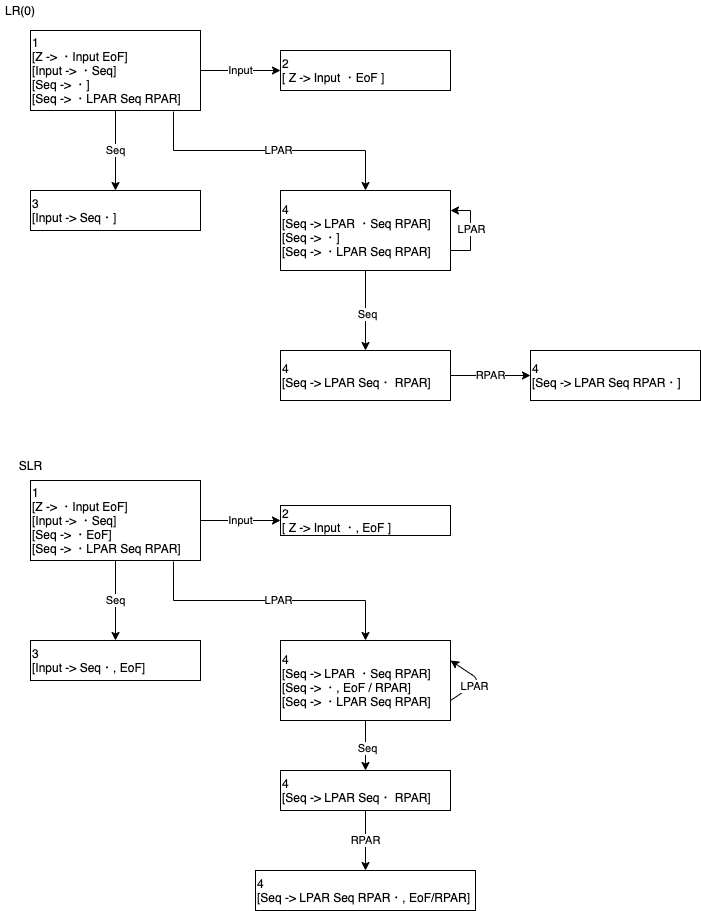

# 7.1

```
0: Z    -> List EoF
1: List -> LPAR Seq RPAR
2: List -> NUM
3: Seq  -> List
4: Seq  -> Seq COMMA List
```

|  | NUM|COMMA|LPAR|RPAR| EoF|List| Seq|
|--|----|----:|----|----|---:|----|----|
| 1|S(4)|     |S(5)|    |    |S(2)|    |
| 2|    |     |    |    |  A |    |    |
| 3|R[3]|R[3] |R[3]|R[3]|R[3]|    |    |
| 4|R[2]|R[2] |R[2]|R[2]|R[2]|    |    |
| 5|S(4)|     |S(5)|    |    |S(3)|S(7)|
| 6|S(4)|     |S(5)|    |    |S(8)|    |
| 7|    |S(6) |    |S(9)|    |    |    |
| 8|R[4]|R[4] |R[4]|R[4]|R[4]|    |    |
| 9|R[1]|R[1] |R[1]|R[1]|R[1]|    |    |

入力
```
LPAR LPAR NUM RPAR COMMA NUM RPAR EoF
```

構文解析

|  | Stack | Rest Input |
|--|:--|:--|
| 1|1 | LPAR LPAR NUM RPAR COMMA NUM RPAR EoF |
| 2|1 LPAR 5 | LPAR NUM RPAR COMMA NUM RPAR EoF |
| 3|1 LPAR 5 LPAR 5 | NUM RPAR COMMA NUM RPAR EoF |
| 4|1 LPAR 5 LPAR 5 NUM 4 | RPAR COMMA NUM RPAR EoF |
| 5|1 LPAR 5 LPAR 5 | List COMMA NUM RPAR EoF |
| 6|1 LPAR 5 LPAR 5 List 3 | COMMA NUM RPAR EoF |
| 7|1 LPAR 5 LPAR 5 | Seq NUM RPAR EoF |
| 8|1 LPAR 5 LPAR 5 Seq 7 | NUM RPAR EoF |
| 9|エラー | RPAR EoF |

# 7.2

# 7.3

```
0: Z -> Seq EoF
1: Seq -> ε
2: Seq -> NUM Seq
```


構文解析表

|  | NUM| Seq| EoF|
|--|----|----|---:|
| 1|S(3)|S(2)|R[1]|
| 2|    |    | A  |
| 3|S(3)|R[2]|R[1]|
| 4|    |    |R[2]|

構文解析結果

| | Stack | Rest Input |
|-|--|--|
|1|1 |NUM NUM EoF|
|2|1 NUM 3| NUM EoF|
|3|1 NUM 3 NUM 3| EoF|
|4|1 NUM 3 |Seq EoF|
|5|1 | Seq EoF|
|6|1 Seq 2| EoF|

# 7.4

```
0: Z -> Input EoF
1: Input -> Seq
2: Seq -> ε
3: Seq -> LPAR Seq RPAR
```



## (1)
状態3 で衝突があるため、 LR(0) 文法ではない

## (2)
衝突がないので SLR(0) 文法

# 7.5

```
0: Z -> Input EoF
1: Input -> Seq
2: Seq -> ε
3: Seq -> EX Seq EX
4: Seq -> QU Seq QU
```

## (1)


状態 4, 7 に還元衝突があるので SLR(0) 文法ではない

## (2)


# 7.6

# 7.7
